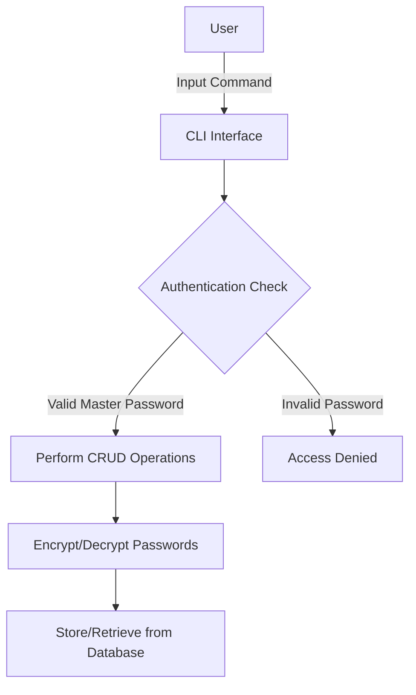
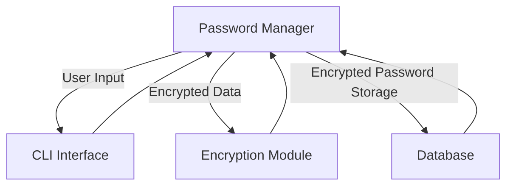
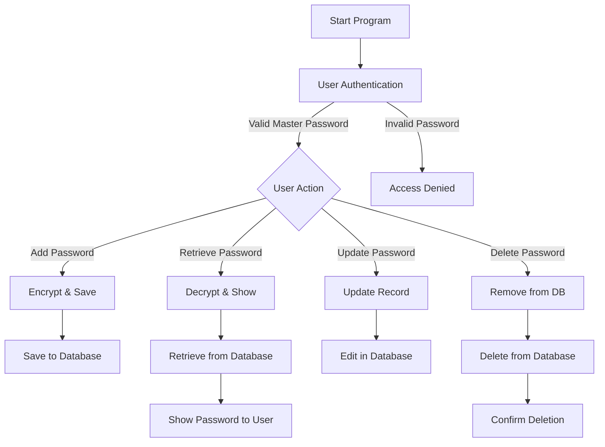

# Password Manager System 🔐

A secure and efficient password management system built using C++, designed to store, retrieve, and manage user credentials with encryption. This system ensures your sensitive information remains safe and easily accessible.
---

## 📚 Table of Contents
- [Project Overview](#-project-overview)
- [Key Features](#-key-features)
- [Goals](#-goals)
- [System Design](#️-system-design)
- [Technologies Used](#-technologies-used)
- [Application Flow](#️-application-flow)
- [Project Structure](#-project-structure)
- [Setup Instructions](#️-setup-instructions)
- [How It Works](#️-how-it-works)
- [Security Considerations](#-security-considerations)
- [Future Scope](#-future-scope)
- [Contributing](#-contributing)
- [License](#license)
- [Contact](#-contact)

---

## 🚀 Project Overview
This Password Manager system provides a secure platform for users to store their passwords in an encrypted format and retrieve them when needed. It offers a command-line interface for efficient credential management, integrating robust encryption algorithms to safeguard sensitive data. The system enables users to:

- Store passwords securely in an encrypted database.
- Retrieve stored passwords by providing appropriate credentials.
- Update or delete stored passwords with ease.
- Categorize passwords for different services.

---

## 🔑 Key Features
- Encryption: Utilizes AES encryption to securely store passwords.
- User Authentication: Protects access with a master password for extra security.
- CRUD Operations: Allows Create, Read, Update, and Delete functionalities for managing - credentials.
- Password Generator: Provides an option to generate strong and random passwords.
- Command-Line Interface: Offers an intuitive text-based interface for user interactions.
- Secure Storage: Ensures that passwords are stored in a secure, encrypted format in the - database.

---

## 🎯 Goals
- Provide a secure solution for managing passwords.
- Leverage C++ for fast and reliable performance.
- Enhance data security through encryption techniques.
- Ensure ease of use with an intuitive CLI interface.

---

## 🏗️ System Design
The Password Manager system follows a modular design to separate the concerns of data storage, encryption, and user interaction. Below is an overview of the system architecture:

#### 🏢 System Architecture

> **Note:** If the diagrams do not render, visit [Mermaid Live Editor](https://mermaid-js.github.io/mermaid-live-editor/) to view or modify them.



#### High-Level Component Diagram

> **Note:** If the diagrams do not render, visit [Mermaid Live Editor](https://mermaid-js.github.io/mermaid-live-editor/) to view or modify them.



---

## 💻 Technologies Used
- Programming Language: C++
- Encryption Library: AES (Advanced Encryption Standard)
- Database: SQLite for local password storage
- User Interface: Command-Line Interface (CLI)

---

## 🖼️ Application Flow
Here’s the high-level workflow of the Password Manager:

> **Note:** If the diagrams do not render, visit [Mermaid Live Editor](https://mermaid-js.github.io/mermaid-live-editor/) to view or modify them.



---

## 📂 Project Structure

```bash
password-manager/
├── include/
│   ├── encryption.h       # AES encryption functions
│   ├── password_manager.h # Main password manager logic
├── src/
│   ├── encryption.cpp     # Implementation of encryption
│   ├── password_manager.cpp # Core logic for password management
├── main.cpp               # CLI Interface implementation
├── db/
│   ├── passwords.db       # SQLite Database file
├── CMakeLists.txt         # CMake configuration
├── README.md              # Project documentation
└── LICENSE                # License information

```

---

## 🛠️ Setup Instructions
### 1. Clone the Repository:
```bash
git clone https://github.com/your-username/password-manager.git
cd password-manager
```

### 2. Install Dependencies:
Ensure that CMake and SQLite are installed on your system.

### 3. Build the Project:
``` bash
mkdir build
cd build
cmake ..
make
```

### 4. Run the Password Manager:
```bash
./password_manager
```
---

## ⚙️ How It Works
### 1. User Authentication
Upon starting the application, the user is prompted to input their master password. This password is used to encrypt and decrypt the stored passwords, providing an additional layer of security.

### 2. Add a New Password
When adding a new password, the user enters the relevant details (e.g., service name, username, password). The system encrypts the password using AES and stores it in the database.

### 3. Retrieve a Password
To retrieve a password, the system decrypts the stored password using the master key and displays it to the user.

### 4. Update or Delete Passwords
Users can update or delete stored passwords by selecting the corresponding entry, which allows for easy management of their credentials.

---

## 🔒 Security Considerations
- **AES Encryption**: All passwords are encrypted using the AES encryption algorithm before - being stored in the database.
- **Master Password**: A master password is required to access the application, ensuring only - authorized users can retrieve or manage stored credentials.
- **No Plaintext Storage**: Passwords are never stored in plaintext format in the database.

---

## 📊 Example

| Action | Input Details | Output Response |
| ----------- | ----- | ---- |
| Add Credential | `Site: Gmail, Password: ****** ` | `Credential Saved Securely` |
| Retrieve | `Site: Gmail` | `Decrypted Password: ******` |
| Update | `Site: Gmail, New Password: ****** ` | `Credential Updated` |
| Delete | `Site: Gmail` | `Credential Deleted` |

---

## 🌟 Future Scope
- **GUI Interface**: Develop a graphical user interface for improved usability.
- **Password Strength Analyzer**: Implement a password strength analyzer to help users create - stronger passwords.
- **Multi-User Support**: Add multi-user functionality for use in shared environments.
- **Biometric Authentication**: Incorporate biometric authentication for enhanced security.
- **Cloud Storage**: Add support for cloud-based storage to sync passwords across devices.

---

## 👨‍💻 Contributing
Contributions are welcome! If you'd like to enhance this project or fix bugs, feel free to submit a pull request or open an issue.

## License

This project is licensed under the [MIT License](./LICENSE).

---

## 📬 Contact
For queries or collaborations, reach me via:

- Email: chaudharisudesh0412@gmail.com
- LinkedIn: [Sudesh Chaudhari](https://www.linkedin.com/in/sudesh-chaudhari)